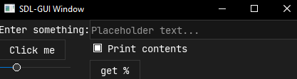

# SDL-GUI

A super simple tkinter-like widget based GUI toolkit to create simple C++ graphical apps.

It uses SDL2 has a backend for creating windows, rendering shapes and colours and fetching input. This information is handled and filtered through two main parent classes, *Parents* and *Widgets*.

**Parents**

- Base class for storing and organising widgets in a grid, handles event hand outs

**Widget**

- Base class for everything that gets displayed, contains all event methods.

## Usage

### Structure

Creating a basic app looks something like this

```c++
Window root = Window();
Entry* entry = new Entry(&root);
entry->grid(0, 0);
Button* button = new Button(&root, "Click me", [](){
	std::cout << "I was clicked" << std::endl;
});
button->grid(0, 1);
root.run();
```

A Parent is created and Widgets are added onto that parent. If the parent is a Window, the window's `run()` method is called. Configuring a widget should ideally take place before adding it to the Parent, however there are some configurations (any that don't affect the look of the widget) which do not matter (binding events, setting tooltips etc) and can be done at any time.


### Multiple Windows

Closing the root window (the first window created / the window with `internal_window_id` of 0) will close all other windows and call `SDL_Quit()`. Because of this, the root window should be **created first** and its `run()` method **called last**. Everything in all windows runs on one thread.

```c++
Window root = Window();
// add everything to the root window
Label *label_1 = new Label(&root, L"Root label");
label_1->grid();

	// Create second window
	Window second = Window();
	Label *label_2 = new Label(&second, L"Second label");
	label_2->grid();
	second.run();

root.run();
```

### Binding Events

Events defined in the `WidgetEvents` enum class can have callbacks (`std::function<void()>`) pushed into a vector which will all be called when that event takes place. This method can be called at any time. For widgets with built-in event handling (i.e Buttons having their own callback for on_release), further callbacks can be added through this method.

So far these widgets are implemented

- Buttons
- Labels
- Entry boxes
- Checkboxes
- Frames
- Slider (int & float)

A valid `font.ttf` file should be in the same directory as the binary. This font should be **fixed width**. This font must be able to display any characters that you wish to display as there are no fallbacks.
Additionally, all widgets should be created using the `new` keyword (`Widget *w = new Widget()`). This is to allow for cleaning up to take place once the window's `run()` has returned.

There can be some issues with unicode on Windows. I believe this is to do with Windows using 2 bytes for `wchar_t` while Linux uses 4. If there are other issues it may be a problem with `setlocale`.

To handle unicode, all strings are `std::wstring` and to communicate with SDL, which uses c-strings, `mbstowcs` and `wcstombs` are used. This means that any in-line strings being passed to widgets should be L strings (`L"text"`).

## Dependencies

To build, the following are required

- SDL2 (`sudo apt install libsdl2-dev`)
- SDL2_ttf (`sudo apt install libsdl2-ttf-dev`)

## Organisation

Organisation can only be created using dynamic grids, meaning they will grow with the items that are 'gridded' and are bigger than previously gridded items.

Frames act as sub-grids allowing for further organisation.

Widgets will be as close as possible without crossing a row or column.

Having two widgets like this:
```
+-----++-----+
| 0,0 || 0,1 |
+-----++-----+
```

And inserting into `1,0` will cause `0,1` to move

```
+-----+   +-----+
| 0,0 |   | 0,1 |
+-----+   +-----+
+---------+
|   1,0   |
+---------+
```

To prevent `0,1` from being moved it, along with `0,0`, can be placed in a frame. This frame would be gridden in `0,0` of the main parent.

## Screenshots


